<div align="center">


<br/>

<table border="0" align="center" cellpadding="12" cellspacing="0">
<tr>
<td align="center" width="200" valign="middle">

<br/><br/>

<br/>

<br/>

</td>
<td align="center" width="230" valign="middle">

</td>
<td align="center" width="200" valign="middle">

<br/><br/>

<br/>

<br/>

</td>
</tr>
</table>

<br/>


<br/><br/>


&nbsp;
[](mailto:pujakumarijb@gmail.com)
&nbsp;
[](https://www.instagram.com/404puja_found/)
&nbsp;
[](https://www.youtube.com/@404PujaFound)

</div>

---

<div align="center">

### 🌸 &nbsp; A B O U T &nbsp; M E &nbsp; 🌸

</div>

<br/>

<table border="0" align="center" cellpadding="0" cellspacing="0">
<tr>
<td valign="top" width="420">

```js
const puja = {
  name        :  "Puja Kumari 🌸",
  role        :  "Frontend Developer & Web Designer",
  degree      :  "B.Tech Graduate — 2023",
  location    :  "Bengaluru, India 🇮🇳",

  passion     :  ["3D Animated Websites",
                  "Beautiful UIs",
                  "Creative Designs"],
  superpower  :  "Turning Figma designs into
                  living, breathing websites ✨",

  techStack   :  ["React.js", "Next.js",
                  "Three.js", "TypeScript",
                  "Tailwind"],
  design      :  ["Figma", "Canva", "Adobe Suite"],

  available   :  "✅  Open to Freelance Projects",
  youtube     :  "🎬  Tech Tips & Web Dev Tutorials",
  instagram   :  "📸  Design Inspo & Creative Work",

  funFact     :  "I turn ☕ into pixel-perfect
                  animated websites ✨"
};
```

</td>
<td valign="middle" align="center" width="220">


</td>
</tr>
</table>

---

<div align="center">

### 💖 &nbsp; W H A T &nbsp; I &nbsp; D O &nbsp; 💖

<br/>

<table border="0" cellpadding="10">
<tr>
<td align="center" width="175">

<br/><br/>
<b>🎨 UI / UX Design</b>
<br/>
<sub>Pixel-perfect, user-first<br/>interfaces that delight</sub>
</td>
<td align="center" width="175">

<br/><br/>
<b>⚡ Frontend Dev</b>
<br/>
<sub>Modern, fast & responsive<br/>web apps with clean code</sub>
</td>
<td align="center" width="175">

<br/><br/>
<b>🪄 3D Websites</b>
<br/>
<sub>Immersive Three.js experiences<br/>that wow visitors</sub>
</td>
<td align="center" width="175">

<br/><br/>
<b>🌟 Brand Design</b>
<br/>
<sub>Creative visual identity<br/>that leaves an impression</sub>
</td>
</tr>
</table>

</div>

---

<div align="center">

### 🎀 &nbsp; T E C H &nbsp; S T A C K &nbsp; 🎀

<br/>

**✦ Languages ✦**


<br/>

**✦ Frontend ✦**


<br/>

**✦ Design Tools ✦**


</div>

---

<div align="center">

### 📺 &nbsp; F O L L O W &nbsp; M Y &nbsp; J O U R N E Y &nbsp; 📸

<br/>

<table border="0" cellpadding="16">
<tr>
<td align="center" width="280">

<br/><br/>
<a href="https://www.youtube.com/@404PujaFound">

</a>
<br/><br/>
<sub>🎬 <b>Tech Tips · Web Dev Tutorials</b><br/>Three.js · React · Frontend Magic<br/><br/><i>✨ Subscribe for weekly dev tips! ✨</i></sub>
</td>
<td align="center" width="280">

<br/><br/>
<a href="https://www.instagram.com/404puja_found/">

</a>
<br/><br/>
<sub>📸 <b>Design Inspo · Creative Work</b><br/>UI Snippets · Behind the Scenes<br/><br/><i>🌸 Follow for daily design inspo! 🌸</i></sub>
</td>
</tr>
</table>

</div>

---

<div align="center">

### 🌺 &nbsp; G I T H U B &nbsp; A C T I V I T Y &nbsp; 🌺

<br/>


&nbsp;&nbsp;


<br/><br/>


</div>

---

<div align="center">

### 💌 &nbsp; L E T ' S &nbsp; C O N N E C T &nbsp; 💌

<br/>

*Loved this README? Want one just like it? Come say hi!* 🌸

<br/>

[](mailto:pujakumarijb@gmail.com)
&nbsp;
[](https://www.instagram.com/404puja_found/)
&nbsp;
[](https://www.youtube.com/@404PujaFound)

<br/>

```
✿ ────────────────────────────────────────────── ✿
    "Design is not just what it looks like.
      Design is how it works — beautifully."
                                    — Puja Kumari
✿ ────────────────────────────────────────────── ✿
```


</div> 
